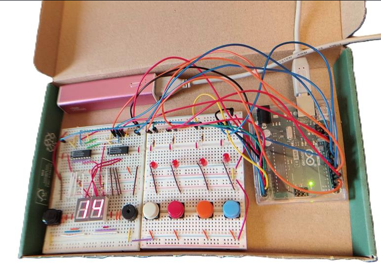
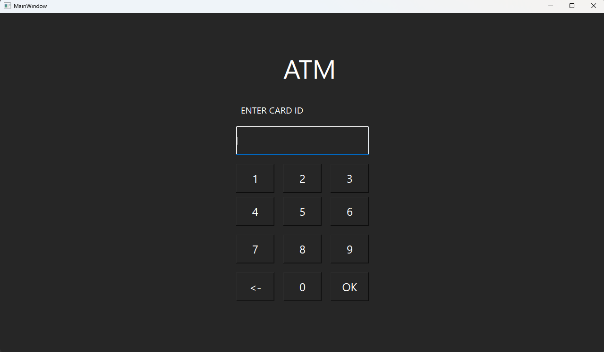

## Introduction
My name is Ville-Pekka Alavuotunki and I'm second year ICT Engineering student in Oulu University of applied sciences. 
I'm passionate about technology and building things, be it a software or a house. Maybe I can combine these two in the future?

## About Me
I have a background in Construction and facility industries and have held various roles, including worker, manager or specialist. My customers and co-workers have said that I'm very productive and on the other hand meticulous and precise at my work who always gives customers the best service possible.  

I've always been passionate about new technology so I decided to pursue a new career in software development. I'm particularly interested in building web sites or applications. In my free time, I enjoy running, gaming or music, and I'm always eager to learn new things.

## Portfolio
Here are some of the projects I've been working on:

### Arduino Reaction Game Project
**Description:** This was the first applied information technology project in Oulu University of Applied Science. Rection game is an arduino based game written in C++. Project was done with group of four students.

**Technologies Used:** `Arduino`, `C++`, `Electronics`

[Project Link](https://github.com/alavuvi/Arduino-ReactionGame)

### ATM-Simulator Project
**Description:** This was the second information technology project in Oulu University of Applied Sciences. The goal was to create an ATM simulator and to get familiar with QT Framework, node.js/express.js and MySQL -database in real world like project. Documentation and diagrams we're also key part of this software development application project.

**Technologies Used:** `C++`, `QT-Framework`, `Node.js`, `Express`, `MySQL`

[Project Link](https://github.com/alavuvi/atm-simulator-project)

## Links
|[My GitHub Profile](https://github.com/alavuvi)| 
|[Linkedin](https://www.linkedin.com/in/alavuotunki)| 
|[X](https://x.com/alavuotunki)|
|[Bluesky](https://bsky.app/profile/alavuotunki.bsky.social)|

## Favorite Music
> Opeth, Cult of Luna, Steven Wilson, Perturbator, Gunship, Röyksopp, Porcupine Tree, Rammstein and many more. 

### My Spotify Profile
You can follow my music journey on [Spotify](https://open.spotify.com/user/vial).